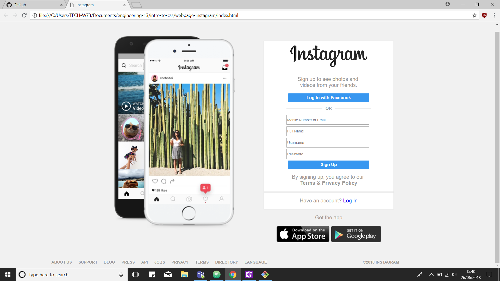

# HTML & CSS
### Responsive webpage design

Using HTML and CSS a responsive webpage has been created that will adjust the content of the page according to the size of browser window or device it is viewed in.

*This was built in week 2 of the engineering stream*

